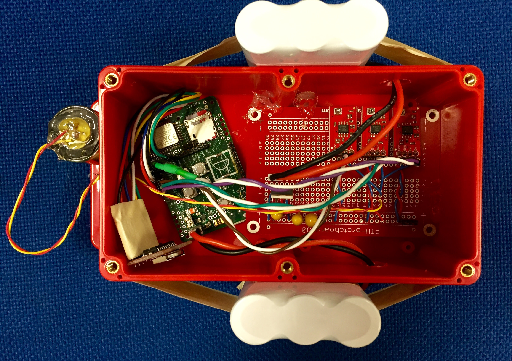

# Sensing Node Version 1

## Processor
The processor used is customized Arduino Due, which can be replaced by regular Arduino Due. The data after ADC is stored on the SD card

## Radio
We used the Zigbee to send start/stop command for data collection over multiple sensing nodes.

## OpAmp
The opamp we used is the BOB-09816 OpAmp Breakout - LMV358 from Sparkfun, the OpAmp is powered separately from the processor to reduce the circuit noise.

