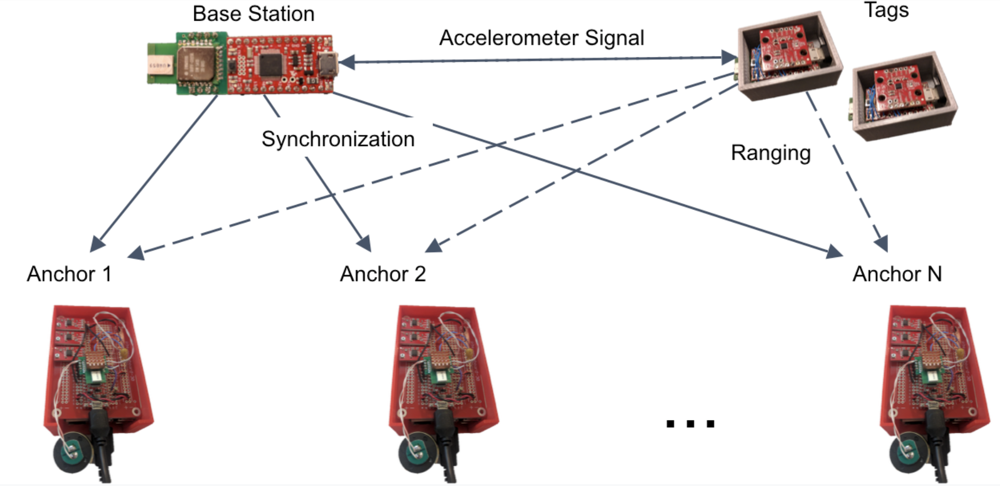
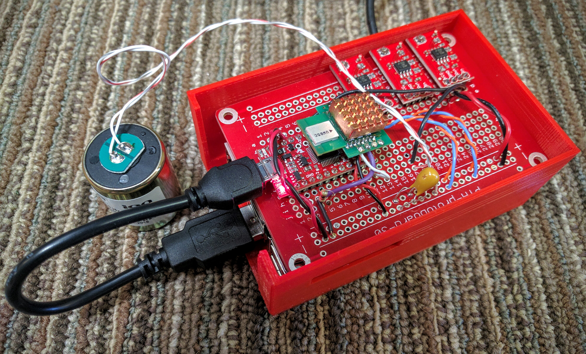

# Hardware Version 2 

The overall system functionality is described below. The Base Station controls all the synchronization through the entire system. The Tags collects foot impact timing information. The Anchors collects the vibration signal as well as the synchronization signal from the Base Station.

## Sensor Node Components

## Sensor Node Installation
The system has both raspberry pi and arduino zero part

### Arduino Zero
The setup guide for Arduino Zero can be found here:
https://learn.sparkfun.com/tutorials/samd21-minidev-breakout-hookup-guide/setting-up-arduino

To flush the code, first of all, you need to install the Arduino Zero from board manager, and remove the Arduino Due board, they are not compatible sometimes.
Then follow the guidance here: https://learn.sparkfun.com/tutorials/samd21-minidev-breakout-hookup-guide/setting-up-arduino
Make sure select SparkFun SAMD21 Mini Breakout as the board when flush.

### Raspberry Pi
First of all, download SD card installation file: 
https://www.raspberrypi.org/downloads/noobs/

Unzip the file and put the files into the SD card formatted as FAT32
Find wired mouse, keyboard, HDMI cable, ethernet cable, and a screen before you start.
Refer to 
https://www.raspberrypi.org/learning/noobs-install/elcapitan/

and
https://github.com/dandanpan/multi-people-tracking 

for the rest of the installation.

When ask for ”Enter interface name”, enter wlan0 to setup the wireless network settings

Furthermore, setup the static IP address for the node for easy access: 
https://www.raspberrypi.org/learning/networking-lessons/rpi-static-ip-address/

Enable SSH on the Pi by following this: 
https://pihw.wordpress.com/guides/direct-network-connection/

### DW1000
The DW1000 Arduino library can be found here:
https://github.com/thotro/arduino-dw1000

The modified DW1000 library is DW1000-20191218T032326Z-001.zip, the file Footstep.h has network setting that needs to be re-configured for the system, including

- NETWORK_ID
- ANCHOR_NUM
- TAG_NUM
- ANCHOR_ID_OFFSET
- TAG_ID_OFFSET 
- RADIO_RESET_COUNT

Decawave 1000: 
http://www.marketwired.com/press-release/decawave-launches-dwm1000-module-for-precise-indoor-location-and-communication-1925616.htm
