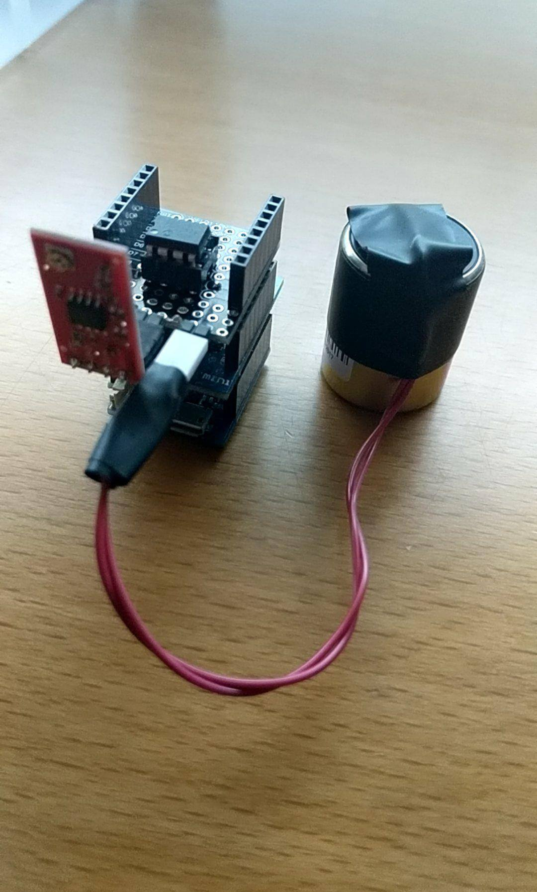

# GeophoneDuino
This repository contains everything related to our Arduino ESP8266 based Geophone sensing node (although it could be used to sample any other sensor).

<table><tr style="border: 0;">
<td width="150" style="border: 0;">
  <p align="center"></p>
</td><td style="border: 0;">
  <h2>Hardware</h2>
  The code assumes the following hardware components are stacked on top of each other:
  <ul>
    <li>Our custom protoshield with an MCP3201 (SPI 12bit ADC), an _optional_ opamp to amplify the geophone signal and the geophone sensor</li>
    <li>WeMos D1 mini (the Arduino ESP8266 itself)</li>
    <li>(_Optional_) Battery shield</li>
  </ul>
</td>
</tr></table>

## Instructions

### Cloning the repo
For the scripts to work, it is important to **clone** the repo instead of simply downloading it.
  1. Locate your Arduino home folder (usually under `<home_dir>/Documents/Arduino` or `<home_dir>/Arduino`)
  2. Open a terminal and navigate to that folder. _E.g._ `cd ~/Documents/Arduino`
  3. Clone the repo:
    ```sh
    git clone https://github.com/CarlosRDomin/GeophoneDuino.git
    ```

### Installing 3rd-party libraries
In order to make it easier to install all libraries, plugins and the Esp8266 core, I added a Python script called `setup.py` (which uses `git submodule` to fetch the right version of each library). To make it easier to read the output of the script, it uses the `coloredlogs` library so messages are color-coded (there should be no red messages unless something went wrong ;P). The steps are:
  1. Open a Terminal console and install the helper Python libraries:
    ```sh
    pip install coloredlogs verboselogs
    ```
  2. Navigate to the root folder in this repo (_e.g._ `cd ~/Documents/Arduino/GeophoneDuino`)
  3. Execute the installation script:
     ```sh
     python setup.py -i
     ```
  **NOTE**: this would install the libraries and the board into the **default Arduino folder** (_eg_ for Mac: `~/Documents/Arduino`). If your `Arduino` folder is somewhere else, specify such path as an argument to the Python script like this: `python setup.py -i -p <PATH>`

  **NOTE 2**: If you get an error like `IOError: [Errno socket error] [SSL: TLSV1_ALERT_PROTOCOL_VERSION] tlsv1 alert protocol version (_ssl.c:590)`, follow these steps:
    1. Install Miniconda2:
      1. Download the [installation script](https://repo.continuum.io/miniconda/Miniconda2-latest-MacOSX-x86_64.sh)
	  2. Execute it:
		```sh
		bash Miniconda2-latest-MacOSX-x86_64.sh
		```
	  3. Prepend miniconda to your `PATH` on `~/.bash_profile` by adding the line: `export PATH="$HOME/miniconda2/bin:$PATH"`
	  4. Reopen the terminal (or open a new tab) so changes take place (_e.g._, `which python` should point to `$HOME/miniconda2/bin/python`)
2. Try installing the 3rd-party libraries again (`python setup.py -i`)

### Installing the USB drivers
The Arduino ESP8266 uses a CH34x chip instead of the more common FTDI. Therefore, the right drivers need to be installed in order for the board to show up when you plug it in through USB. Driver file (for Mac) is available under `Datasheets and useful info/CH34x_Install_V1.4.pkg`. Simply double click and follow the on-screen instructions (might need to reboot).

### How to flash the firmware?
 1. Open the file `GeophoneDuino.ino` in the Arduino IDE.
 2. Plug in the ESP8266 through USB, select the right port on `Tools > Port` (_eg_: `\dev\cu.wchusbserial14440`) and configure the board as:
   - Board: WeMos D1 R2 & mini
   - Flash size: 4M (1M SPIFFS)
   - Debug port: Disabled
   - Debug level: None
   - lwIP variant: v2 higher bandwidth
   - CPU frequency: 160 MHz
   - Upload speed: 921600
   - Erase Flash: only Sketch
 3. Copy SPIFFS (filesystem) files by clicking on `Tools > ESP8266 upload SPIFFS files`. This step will allow you to:
       - Connect to the Arduino's own hotspot (which is automatically created whenever it is unable to connect to the default WiFi network), perform a network scan and [configure which network it should connect to](#how-to-configure-which-network-to-join).
       - [Visualize sensor data in real-time wirelessly](#how-to-see-real-time-sensor-data) (doesn't even need an Internet connection)
 4. Upload the sketch (`Sketch > Upload`)

### How to configure which network to join?
In order to wirelessly interact with the Arduino, both devices need to be in the same network. One could change these settings in the code and reflash the firmware every time the testing/deployment environment changes, but sometimes this isn't ideal.

Instead, the Arduino will create its own hotspot if it is unable to connect to the preconfigured network within 10s, so that we can connect to it and update its settings.
Note that by default, the network name will be `Geophone_ABCDEF` (where `ABCDEF` will be replaced by its hex serial number) and password will be `geophone`.

Once connected, its IP should be `192.168.0.1`. We can access its wireless settings by opening a web browser and navigating to `192.168.0.1/WiFi`. The webpage will automatically trigger a network scan and all available networks will be displayed within a few seconds. Then, we can configure which network to join, the password, desired IP, etc. and click Connect.
Note that, upon successful network connection, the hotspot will be turned off and therefore our laptop/device will also need to connect to a different network.

### How to see real-time sensor data?
Once both the Arduino and our laptop/phone/device are connected to the same network, we can simply open a web browser and navigate to `<Arduino IP>/` or, equivalently, `<Arduino IP>/index.html` and a live stream of data will show up. Click `Close socket` to stop streaming or `Save data` to download a `csv` file with all data recorded.

### How to collect (store to file) data?
The Python script to collect data relies on a WebSocket implementation and a colored logging library which need to be installed before the first use. Simply open a terminal and execute:
```sh
pip install ws4py coloredlogs verboselogs
```

Then, you have two options to specify which IP(s) to collect data from:
  * As a list (`-l`, separated by spaces):
    ```sh
    python data_collection.py -l 192.168.0.101 192.168.0.105 192.168.0.109
    ```
  * As a range (`-r`, entering IP prefix, followed by the starting and ending (inclusive) IPs in the range):
    ```sh
    python data_collection.py -r 192.168.0 102 107  # Would connect to 192.168.0.102, 192.168.0.103, ..., 192.168.0.107
    ```

For additional parameters or for help, type `python data_collection.py -h`.
To stop collecting data, press `Ctrl + C` at any time.
